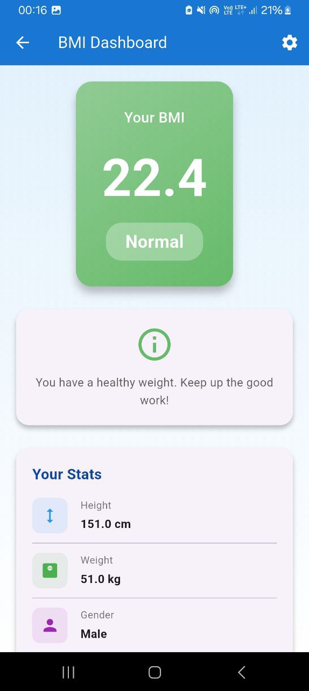
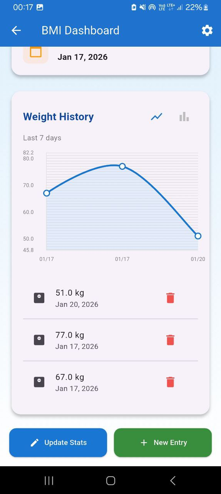

# BMI Tracker

A feature-rich Flutter application for calculating and tracking Body Mass Index (BMI) with multi-user profile support, weight history visualization, and Firebase authentication.

## � Screenshots

### Login & Authentication


### Profile Details Entry


### BMI Dashboard & Stats


### Weight History Graph


### Profile Management


---

## �📋 Features

✅ **Authentication**
- Email/Password login and registration
- Google Sign-In authentication
- Password reset functionality
- Auth state persistence with automatic routing

✅ **Multi-User Profiles**
- Create and manage multiple profiles
- Switch between profiles seamlessly
- Edit profile information
- Delete profiles with undo support

✅ **BMI Calculation**
- Calculate BMI based on height and weight
- Support for metric (cm, kg) and imperial (ft, lbs) units
- Real-time BMI category determination
- Personalized health recommendations

✅ **Weight Tracking**
- Log weight entries with dates
- View 7-day weight history
- Delete entries with undo functionality
- Measurement date picker

✅ **Data Visualization**
- Interactive weight history graphs
- **Toggle between Line Chart and Bar Chart** views
- Tooltips showing weight and date on hover
- Automatic data scaling with smart padding

✅ **User-Friendly UI**
- Modern Material Design
- Gradient backgrounds and smooth animations
- Side-by-side height/weight input pickers
- Cupertino wheel selectors for height and weight
- Responsive layout for all screen sizes

## 🏗️ Project Structure

```
lib/
├── main.dart                      # App entry point & auth routing
├── firebase_options.dart          # Firebase configuration
│
├── core/
│   ├── services/
│   │   ├── auth_service.dart      # Firebase auth & Google sign-in
│   │   └── firestore_service.dart # Firestore CRUD operations
│   └── utils/
│       └── bmi_calculator.dart    # BMI calculation & categorization
│
├── features/
│   ├── auth/
│   │   ├── login_screen.dart      # Login with email/Google
│   │   ├── register_screen.dart   # New account creation
│   │   └── reset_password_screen.dart  # Password recovery
│   │
│   ├── bmi/
│   │   ├── bmi_screen.dart        # BMI dashboard & stats
│   │   └── weight_graph.dart      # Line/Bar chart visualization
│   │
│   └── profile/
│       ├── user_form.dart         # Create/edit profile form
│       ├── profile_switch_screen.dart   # Switch between profiles
│       └── settings_screen.dart   # Profile management settings
│
└── models/
    ├── user_profile.dart          # User profile model
    ├── weight_entry.dart          # Weight entry model
    └── user_model.dart            # Auth user model
```

## 🚀 Getting Started

### Prerequisites

- Flutter SDK 3.9.0 or higher
- Dart 3.9.0 or higher
- Android Studio / Xcode (for mobile development)
- Firebase project setup
- Google Sign-In credentials

### Installation

1. **Clone the repository**
   ```bash
   git clone <repository-url>
   cd bmi_tracker
   ```

2. **Install dependencies**
   ```bash
   flutter pub get
   ```

3. **Firebase Setup**
   - Create a Firebase project at [console.firebase.google.com](https://console.firebase.google.com)
   - Enable Authentication (Email/Password + Google Sign-In)
   - Enable Cloud Firestore database
   - Download `google-services.json` (Android) and `GoogleService-Info.plist` (iOS)
   - Place files in appropriate directories:
     - Android: `android/app/google-services.json`
     - iOS: `ios/Runner/GoogleService-Info.plist`

4. **Configure Firebase (if needed)**
   ```bash
   flutterfire configure
   ```

5. **Run the app**
   ```bash
   flutter run
   ```

## 📱 Usage Guide

### 1. **Authentication**
- Launch the app → Login/Register screen appears
- **Login Options:**
  - Email/Password: Enter credentials and tap "Login"
  - Google: Tap "Sign in with Google" (uses original Google logo from assets)
- **Register:** New users can create account via "Register" link

### 2. **Creating Your First Profile**
- After login, fill in profile details:
  - **Profile Name:** Choose a unique identifier
  - **Measurement Date:** Use date picker (defaults to today)
  - **Height:** Select unit (CM/FT), tap button to open wheel picker
  - **Weight:** Select unit (KG/LBS), tap button to open wheel picker
  - **Gender:** Select from dropdown
- Tap "Calculate BMI" → Automatically saved and navigates to BMI Dashboard

### 3. **BMI Dashboard**
- **View Stats:** Current BMI, category, height, weight, gender, recorded date
- **Health Info:** Personalized recommendations based on BMI category
- **Weight History Graph:**
  - View 7-day weight progression
  - **Toggle Chart Type:** Use line/bar icons to switch visualization
  - **Tooltips:** Hover over data points to see exact values
  - **Edit/Delete:** Remove outdated entries with undo option

### 4. **Managing Profiles**
- **Profile Switch:** Tap settings icon → "Switch Profile" → Select profile
- **Edit Profile:** In BMI Dashboard, tap "Update Stats" to modify measurements
- **Delete Profile:** In settings, tap "Delete" (with undo recovery)

### 5. **Settings**
- Access via settings icon (⚙️) in app bar
- Manage multiple profiles
- Profile deletion with undo capability

## 🛠️ Technology Stack

| Technology | Purpose |
|-----------|---------|
| **Flutter** | Cross-platform mobile UI framework |
| **Firebase Auth** | User authentication & Google Sign-In |
| **Cloud Firestore** | Real-time database for profiles & weights |
| **fl_chart** | Interactive graph visualization |
| **intl** | Date/time formatting & localization |
| **Material Design 3** | Modern UI components & patterns |

## 🔐 Authentication Flow

```
┌─────────────────┐
│   Launch App    │
└────────┬────────┘
         │
         ▼
┌─────────────────────────┐
│ Check authStateChanges  │
└────────┬────────────────┘
         │
    ┌────┴─────┐
    │           │
   YES         NO
    │           │
    ▼           ▼
ProfileSwitch LoginScreen
Screen
```

## 📊 Database Structure (Firestore)

```
users/
└── {uid}/
    ├── profiles/
    │   └── {profileId}/
    │       ├── name: String
    │       ├── height: Double
    │       ├── weight: Double
    │       ├── gender: String
    │       ├── date: DateTime
    │       ├── heightUnit: String (cm/in)
    │       └── weightUnit: String (kg/lbs)
    │
    └── {profileId}/
        └── weights/
            └── {entryId}/
                ├── weight: Double
                ├── weightUnit: String
                └── date: DateTime
```

## ⚙️ Configuration

### Firebase Security Rules

```firestore
rules_version = '2';
service cloud.firestore {
  match /databases/{database}/documents {
    match /users/{uid}/profiles/{document=**} {
      allow read, write: if request.auth.uid == uid;
    }
  }
}
```

### Supported Units

- **Height:** Centimeters (cm) or Feet/Inches (ft/in)
- **Weight:** Kilograms (kg) or Pounds (lbs)
- Automatic conversion to kg/cm for BMI calculation

## 📈 BMI Categories

| BMI Range | Category | Color |
|-----------|----------|-------|
| < 18.5 | Underweight | 🔵 Blue |
| 18.5 - 24.9 | Normal | 🟢 Green |
| 25.0 - 29.9 | Overweight | 🟠 Orange |
| ≥ 30.0 | Obese | 🔴 Red |

## 🎨 UI Highlights

- **Gradient Backgrounds:** Professional blue gradients
- **Interactive Charts:** Smooth animations with hover tooltips
- **Cupertino Pickers:** Native iOS-style wheel selectors
- **Form Validation:** Real-time inline error messages
- **Undo Support:** Delete operations with 1-tap recovery

## ⚠️ Error Handling

- **Network Errors:** User-friendly snackbar notifications
- **Validation:** Form validation with helpful error messages
- **Firestore Errors:** Graceful error recovery with retry options
- **Auth Errors:** Clear messaging for login/registration issues

## 🔄 Undo Functionality

- **Weight Entry Deletion:** Delete and restore with "Undo" button
- **Profile Deletion:** Remove profile with instant recovery option
- **Automatic Cleanup:** Undo action expires after snackbar timeout

## 🌐 Localization

- Date formatting: Locale-aware (MMM dd, yyyy)
- Number formatting: 1 decimal place for BMI and weights
- Metric/Imperial support for international users

## 📞 Support & Troubleshooting

### Common Issues

| Issue | Solution |
|-------|----------|
| Google Sign-In fails | Verify `google-services.json` placement & Firebase config |
| Firestore permission denied | Check Firebase security rules & user UID |
| Charts not displaying | Ensure `fl_chart` package is properly installed |
| Asset image not found | Verify `asset/image.png` path in `pubspec.yaml` |

## 🚀 Building for Production

### Android
```bash
flutter build apk --release
# or
flutter build appbundle --release
```

### iOS
```bash
flutter build ios --release
```

## 📝 Dependencies

Key packages used:
- `firebase_core` - Firebase initialization
- `firebase_auth` - Authentication
- `cloud_firestore` - Database
- `google_sign_in` - Google authentication
- `fl_chart` - Graph visualization
- `intl` - Date formatting

See `pubspec.yaml` for complete dependency list.

## 📄 License

This project is provided as-is for personal and educational use.

## 👤 Author

BMI Tracker - Flutter Project

---

**Last Updated:** January 21, 2026  
**Version:** 1.0.0  
**Status:** Active Development
